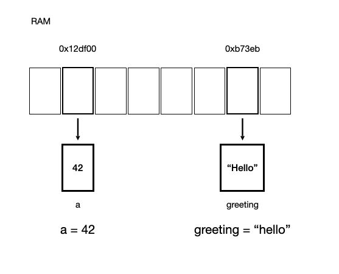
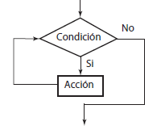

# Sesión 1 / 10 Mayo 2021

El objetivo de esta sesión fue introducir los conceptos basicos del lenguaje, explorar los tipos de datos y operadores de los que dispone Python y finalmente revisar la sintaxis basica de las estructuras de control basicas (condicionales y bucles).

**Bibliografia recomendada:**

- [R. G. Duque. (2011). Python para todos (págs. 7 - 32)](../lecturas/python-para-todos.pdf)
- [Lutz, M. (2013). Learning Python. (págs. 3 - 195) O'Reilly.](https://www.amazon.com/-/es/Mark-Lutz/dp/1449355730)
- [Lutz, M. (2014). Python Pocket Reference (págs. 3 - 42). O'Reilly.](https://www.amazon.com/-/es/Mark-Lutz/dp/1449357016/)

<br/>

# Contenido de la sesión


## Fundamentos
<br/>

### ¿Por qué usar Python?

- Mayor legibilidad
- Mayor productividad
- Portabilidad
- Variedad de bibliotecas disponibles
- Extensible

### ¿Que puedo hacer con Python?

- Aplicaciones de escritorio
- Aplicaciones web
- Programacion cientifica
- Data Mining, Machine Learning, Deep Learning
- Extensiones
- Juegos
- Robotica
- etc

**Ejemplos diversos:**

- https://github.com/joelibaceta/video-to-ascii
- https://github.com/joelibaceta/zerg-infestation-strategy
- https://github.com/joelibaceta/xls-cli
- https://github.com/Funny-OpenSource-Projects/image-to-xls

<br/>

## Instalacion y configuración del entorno


### Windows

1. Descargar instalador de https://www.python.org/downloads/windows/
2. Abrir el instalador y marcar la casilla Add Python to PATH
3. Click en Install Now

### Mac

1. Con homebrew, ejecutar:

    ```brew install python```

<br/>

## Variables 

<br/>

### Variables



## Tipos de datos

Python Core Data Types

- Numbers ( Numeros )
- Booleans ( Booleanos )
- Strings ( Cadenas )

### Numeros

En Python se pueden representar números enteros,
reales y complejos.

- Enteros

Los números enteros son aquellos números positivos o negativos que
no tienen decimales (además del cero).

```
a = 5
b = -4
c = 3L
```

- Reales

Los números reales son los que tienen decimales.

```
r = 0.4564
r = 0.1e-3
```

- Complejos

Los números complejos son aquellos que tienen parte imaginaria.

```
c = 2.1 + 7.8j
```

### Booleanos

Una variable de tipo booleano sólo puede tener dos valores: `True` (cierto) y `False` (falso).


```
a = True
b = False
```

### Cadenas

Las cadenas no son más que texto encerrado entre comillas simples
(‘cadena’) o dobles (“cadena”).

```
a = "uno"
b = "dos"
```

También es posible encerrar una cadena entre triples comillas. De esta forma podremos escribir el texto en varias líneas.

```
triple = “““primera linea
    esto se vera en otra linea”””
```

## Operadores

**Operadores Unarios**

| Operador | Descripción     | Ejemplo                         |
|----------|-----------------|---------------------------------|
| not      | Negación logica | not True   # retorna False      |
| -        | Negación        | -5   # retorna el negativo de 5 |

**Operadores Binarios**

| Operador | Descripción     | Ejemplo               |
|----------|-----------------|-----------------------|
| -        | Resta           | 8 - 4  # retorna 4    |
| +        | Negación        | 3 + 5  # retorna 8    |
| /        | División        | 5 / 2.0 # retorna 2.5 |
| *        | Multiplicación  | 3 * 3 # retorna 9     |
| **       | Exponente       | 2 ** 4 # retorna 16   |
| //       | División Entera | 8 // 3 # retorna 2    |
| %        | Modulo          | 5 % 2  # retorna 1    |

| Operador | Descripción | Ejemplo                |
|----------|-------------|------------------------|
| >        | Mayor       | 3 > 4 # retorna False  |
| <        | Menor       | 5 < 3  # retorna False |
| ==       | Igual       | 4 == 4 # retorna True  |
| !=       | Diferente   | 3 != 5 # retorna True  |

| Operador | Descripción                                 | Ejemplo                        |
|----------|---------------------------------------------|--------------------------------|
| and      | Si el lado izquierdo y derecho es verdadero | True and False # retorna False |
| or       | Si el lado izquierdo o derecho es verdadero | True or False  # retorna True  |


## Condicionales

Los condicionales nos permiten comprobar condiciones y hacer que nuestro
programa se comporte de una forma u otra, que ejecute un fragmento
de código u otro, dependiendo de esta condición.



Ejemplo

```
if numero < 0:
    print “Negativo”
elif numero > 0:
    print “Positivo”
else:
    print “Cero”
```

## Bucles

Los bucles nos permiten ejecutar un mismo fragmento de código un cierto número de veces o recorrer un conjunto de datos.


```
secuencia = [“uno”, “dos”, “tres”]

for elemento in secuencia:
    print elemento
```